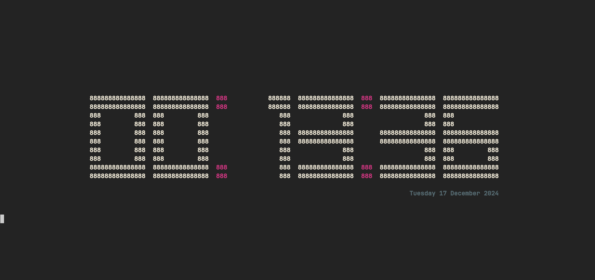
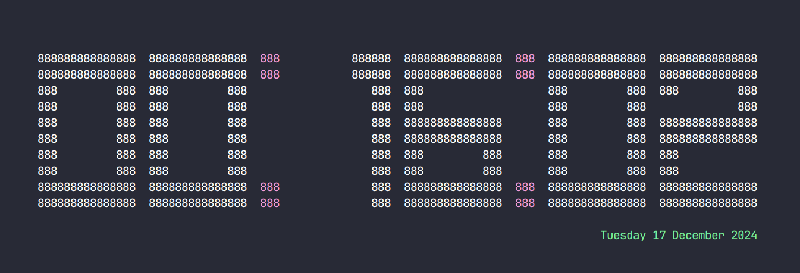
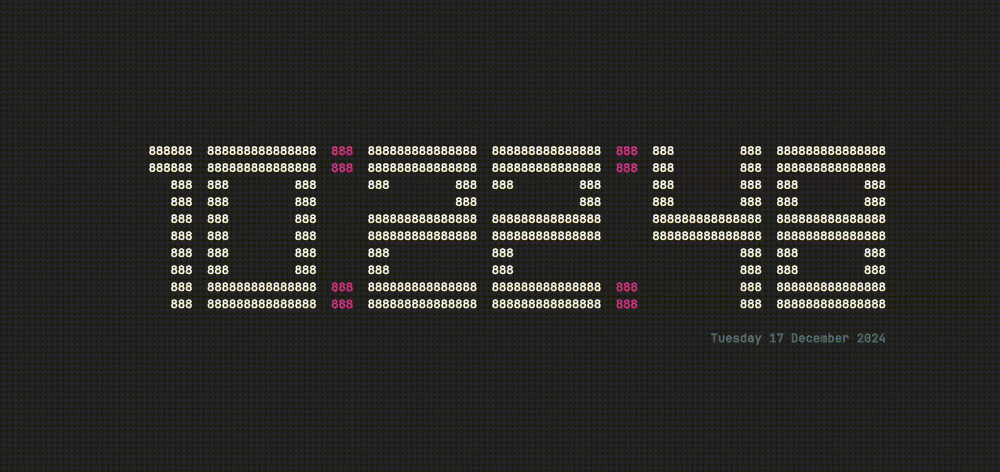

# ASCII Clock

A simple ASCII art clock implemented in C.

## Features

- Displays current time in ASCII art
- Customizable display options (coming soon)
- Lightweight and easy to use

## Installation

```bash
git clone https://github.com/arnabdebnath208/asciiclock.git
cd asciiclock/src/C
make
```

## Usage

```bash
cd asciiclock/src/C
./asciiclock
```

## Screenshots




## Screen Recording




## Contributing

1. Fork the repository
2. Create your feature branch (`git checkout -b feature/your-feature`)
3. Commit your changes (`git commit -am 'Add some feature'`)
4. Push to the branch (`git push origin feature/your-feature`)
5. Create a new Pull Request

## License

This project is licensed under the GPL-3.0 - see the [LICENSE](LICENSE) file for details.